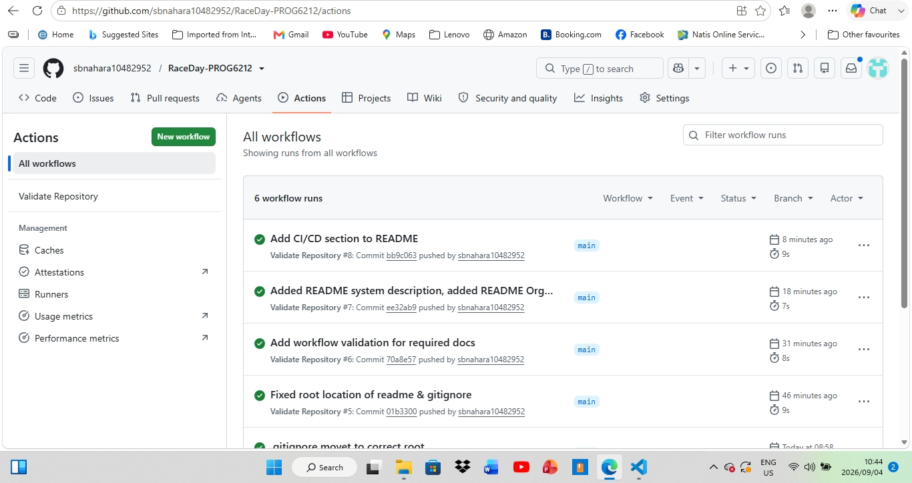

# RaceDay

## PROG6212 Portfolio of Evidence – Part 1

RaceDay is a web-based event management system designed for the South African road running, walking and cycling community.

The system provides a platform for Event Organisers to manage events, categories, participant enrolments and results. Participants can use the system to browse available events, enter events and view their own enrolments and results.

## Part 1

Part 1 focuses on planning the RaceDay system before implementation. The planning artefacts include:

- Entity Relationship Diagram (ERD)
- REST API Endpoint Plan
- SQL Server Database Script
- SQL Database Verification Screenshots

## Documentation

All Part 1 planning documentation is stored in the `/docs` folder.

### ERD

The database Entity Relationship Diagram is available as:

- `RaceDay_ERD.png`
- `RaceDay_ERD.drawio`

### API Endpoint Plan

The planned REST API endpoints are documented in:

- `RaceDay_API_Endpoint_Plan.pdf`

### Database

The SQL Server database script is available in:

- `RaceDay_Database.sql`

Database verification screenshots are available in:

- `SQL_Screenshots.pdf`

## System Description

RaceDay is a web-based event management system for road running, walking and cycling events.

The system allows Event Organisers to create and manage events, manage event categories, capture participant results and manage event information.

Participants can register for an account, browse available events, enter events, select event categories and view their own enrolments and results.

The Part 1 planning documentation establishes the database structure, planned REST API and SQL Server database required for the later implementation stages of the RaceDay system.

## User Roles

### Event Organiser

The Event Organiser is responsible for managing RaceDay events.

The Organiser can:

- Create events
- Edit event information
- Delete events
- Manage event categories
- View event enrolments
- Capture participant results
- Manage event-related information

### Participant

The Participant uses RaceDay to discover events and manage their participation.

The Participant can:

- Create an account
- Browse upcoming events
- View event information
- Enter an event
- Select an event category
- View their enrolments
- View their personal results

## CI/CD

RaceDay uses GitHub Actions to automatically validate the repository whenever changes are pushed to GitHub or submitted through a pull request.

The repository validation workflow checks that:

- The `/docs` folder exists.
- The required ERD files exist.
- The API endpoint plan exists.
- The SQL database script exists.
- The SQL verification screenshots exist.
- The README exists and contains content.
- The `.gitignore` file exists.

A successful workflow run is displayed by GitHub with a green check mark.

## Successful CI/CD Build

The screenshot below shows a successful GitHub Actions repository validation build.

## Part 1 Walkthrough Video

The Part 1 planning documents and design decisions are explained in the walkthrough video below.

[Watch the RaceDay Part 1 walkthrough on YouTube] https://youtube.com/shorts/uIO2nlMq_Vw?feature=share

## AI Use Disclosure

AI tools were used during the preparation of this Portfolio of Evidence to assist with planning, documentation, proofreading and understanding of development concepts.

The student reviewed, adapted and integrated the resulting work and remains responsible for understanding the submitted work and ensuring that it meets the assessment requirements.