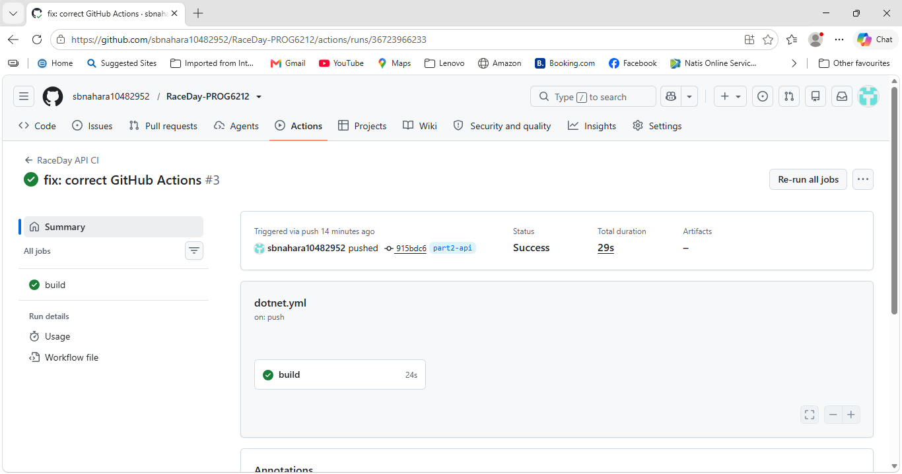

# RaceDay Event Management System

## 1. Project Overview

RaceDay is a web-based event management system designed for running, walking and cycling events. The system allows organisers to manage events, categories, participant enrolments and race results. Participants can create an account, view available events, enrol in an event and view their personal results.

The project was developed as part of the PROG6212 Portfolio of Evidence.

## 2. Main Features

- User registration and login
- Session-based authentication
- Role-based access for Organisers and Participants
- User profile viewing and updating
- Event creation, viewing, editing and cancellation
- Event category management
- Participant event enrolment
- Organiser access to event enrolments
- Race result capture
- Participant result viewing
- SQL Server database
- Entity Framework Core Code-First
- RESTful API
- Automated unit testing
- GitHub Actions CI/CD

## 3. User Roles

### Organiser

Organisers can:

- Create events
- Edit events
- Cancel events
- Manage event categories
- View participant enrolments
- Capture race results
- View event results

### Participant

Participants can:

- Register an account
- Log in and log out
- View and update their profile
- Browse available events
- View event categories
- Enrol in an event category
- View their own enrolments
- View their personal race results

## 4. Technology Used

- C#
- ASP.NET Core Web API
- .NET 10
- Entity Framework Core
- SQL Server
- Visual Studio 2026
- Git
- GitHub
- GitHub Actions
- xUnit

## 5. Database

The project uses SQL Server as the database platform.

Entity Framework Core Code-First is used to create and manage the database structure.

The main entities are:

- User
- Event
- Category
- EventCategory
- Enrolment
- Result

The database uses primary keys, foreign keys, unique constraints, validation rules and relationships between the entities.

## 6. REST API

The API follows a RESTful structure.

Examples of endpoints include:

- `POST /api/auth/register`
- `POST /api/auth/login`
- `POST /api/auth/logout`
- `GET /api/users/me`
- `PUT /api/users/me`
- `GET /api/events`
- `GET /api/events/{eventId}`
- `POST /api/events`
- `PUT /api/events/{eventId}`
- `DELETE /api/events/{eventId}`
- `POST /api/enrolments`
- `GET /api/enrolments/me`
- `POST /api/enrolments/{enrolmentId}/result`
- `GET /api/results/me`

Access to protected functionality is controlled using the logged-in user's session and role.

## 7. Authentication and Security

RaceDay uses session-based authentication.

Passwords are not stored as plain text. Passwords are protected using PBKDF2 hashing with a randomly generated salt.

The system checks the user's role before allowing access to organiser or participant functionality.

## 8. Event Types

RaceDay supports three event types:

- Run
- Walk
- Cycle

Each event records information such as the event name, description, date, start time, location, distance and event type.

## 9. Testing

The project contains a separate `RaceDay.API.Tests` project.

Unit tests are used to test important functionality, including password hashing and password verification.

The tests are executed using xUnit.

## 10. GitHub Actions / CI/CD

GitHub Actions is used to automatically build and test the project when changes are pushed to GitHub.

The workflow is located at:

```text
.github/workflows/dotnet.yml
```

The CI workflow:

1. Checks out the repository
2. Sets up .NET 10
3. Restores project dependencies
4. Builds the test project
5. Runs the unit tests

A successful workflow run is shown by a green check on GitHub Actions.

## 11. Project Structure

```text
RaceDay-PROG6212
│
├── .github
│   └── workflows
│       └── dotnet.yml
│
├── docs
│   ├── ERD documentation
│   ├── API Endpoint Plan
│   └── SQL documentation
│
├── RaceDay.API
│   ├── Controllers
│   ├── Data
│   ├── Models
│   └── Services
│
├── RaceDay.API.Tests
│   └── PasswordServiceTests.cs
│
├── .gitignore
└── README.md
```

## 12. Running the Project

1. Open the project in Visual Studio 2026.
2. Make sure the `RaceDay.API` project is selected as the startup project.
3. Check the SQL Server connection string in `appsettings.json`.
4. Build the solution.
5. Run the application.
6. Use Swagger to test the API endpoints.

## 13. Git Branches

The project uses a separate branch for Part 2 API development:

```text
part2-api
```

The Part 2 work is committed and pushed to GitHub using this branch.

## 14. Part 1 Documentation

The `docs` folder contains the planning and database documentation completed for Part 1, including:

- Entity Relationship Diagram
- API Endpoint Plan
- SQL Server database script
- Database verification screenshots

## 15. AI Use Disclosure

AI tools were used as a development support tool during the project. They were used for guidance, explanations, troubleshooting, code suggestions and documentation support.

The final project was reviewed, tested and implemented by myself the student. AI assistance was not used as a replacement for understanding or testing the submitted work.



Youtube Unlisted Link for Part 2:
https://youtube.com/shorts/uIO2nlMq_Vw?feature=share
